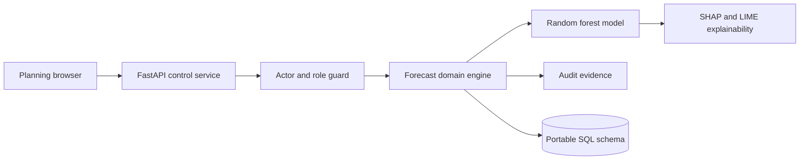
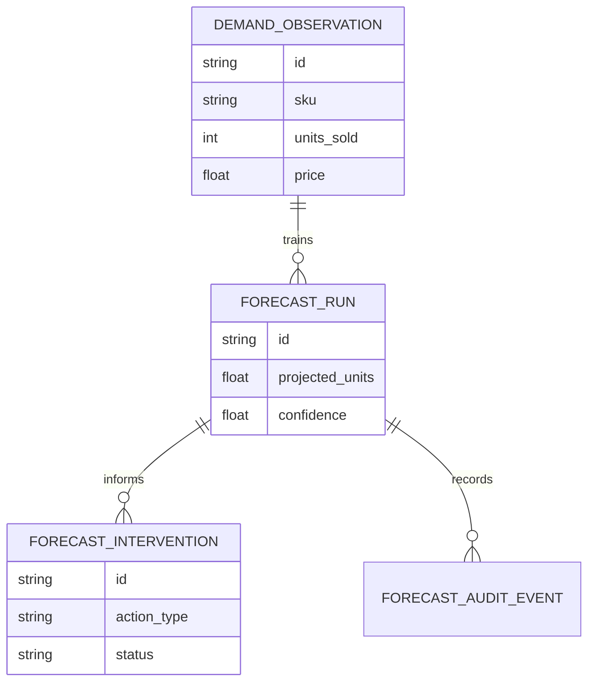
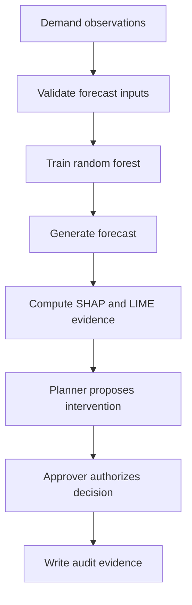
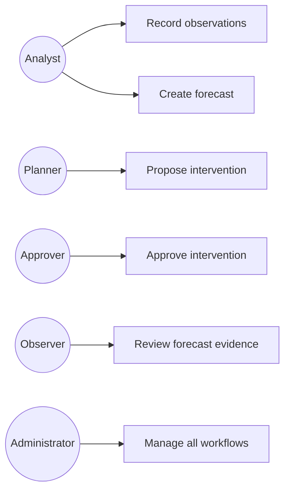
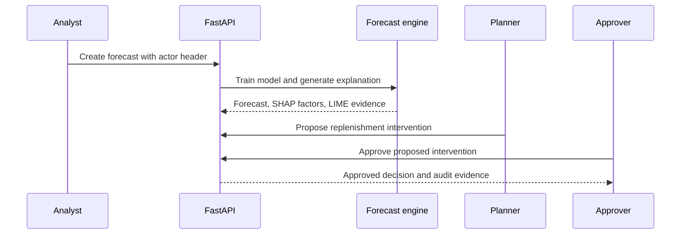

# Python Demand Forecast Explainability Intervention Control Platform

## The Problem

Demand planning teams often receive a forecast number without a defensible explanation of why it moved or which operational decision should follow. Without model evidence, planners cannot distinguish a price effect from promotional uplift, approvers cannot challenge an inventory intervention, and every replenishment decision becomes difficult to audit after the fact.

## The Solution

This FastAPI platform trains a random forest demand forecast from validated sales observations, records forecast confidence, calculates SHAP feature contributions, produces LIME local explanations, and routes replenishment interventions through role guarded approval. Analysts can create a forecast, planners can propose an intervention, and approvers can authorize the decision. Every forecast and intervention mutation produces durable audit evidence in the domain boundary.

## Live Demo & Tech Stack

Run the service locally and open `http://localhost:10900` to use the planning board. The board includes a local workspace seed for evaluating the complete forecast and approval workflow. It uses development identity headers to demonstrate role boundaries. A production deployment should resolve actor and role claims at an upstream identity gateway.

| Concern | Implementation |
|---|---|
| Forecast model | Python 3 with scikit learn random forest demand regression |
| Explainability | SHAP TreeExplainer feature contributions and LIME local feature explanation rows |
| Operational control | Role guarded analyst, planner, approver, administrator, and observer workflows |
| Planning UI | FastAPI delivered browser board for training data, forecast evidence, interventions, and approvals |
| Delivery controls | pytest coverage, Docker image, Docker Compose, GitHub Actions CI, and portable SQL schema |

## Local Setup & Run Instructions

```bash
git clone https://github.com/kholipha-ahmmad-al-amin/python-demand-forecast-explainability-intervention-control-platform.git
cd python-demand-forecast-explainability-intervention-control-platform
python3 -m pip install -r requirements.txt
python3 -m pytest -q
PORT=10900 uvicorn app.main:app --host 0.0.0.0 --port 10900
```

The service binds to `0.0.0.0` and exposes `GET /health`, `GET /api/snapshot`, `POST /api/observations`, `POST /api/forecasts`, `POST /api/interventions`, `POST /api/interventions/{id}/approve`, and `POST /api/demo`. Protected routes require `X-Actor` and `X-Role` headers. Valid roles are `ANALYST`, `PLANNER`, `APPROVER`, `ADMIN`, and `OBSERVER`.

## System Documentation (Mermaid.js)

### Architecture



### ERD



### Data Flow



### Use Case



### Sequence



## Owner

Created and maintained by Kholipha Ahmmad Al-Amin.

Software Engineer and AI Specialist

Founder and CEO of EquiSaaS BD

Principal Consultant at AR IT Consultancy

Full Stack Developer and SaaS Product Builder

### Official links

Portfolio: https://kholipha-ahmmad-al-amin.equisaas-bd.com/

GitHub: https://github.com/kholipha-ahmmad-al-amin

LinkedIn: https://www.linkedin.com/in/kholipha-ahmmad-al-amin

X: https://x.com/al_amin5519

Facebook: https://www.facebook.com/kholipha.ahmmad.al.amin

Instagram: https://www.instagram.com/kholipha.ahmmad.al.amin

## Ownership

This project was created and is maintained by Kholipha Ahmmad Al-Amin.
